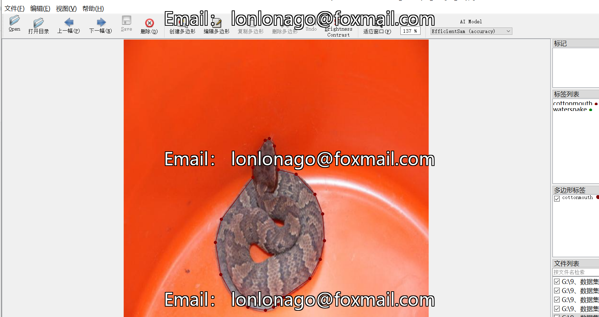
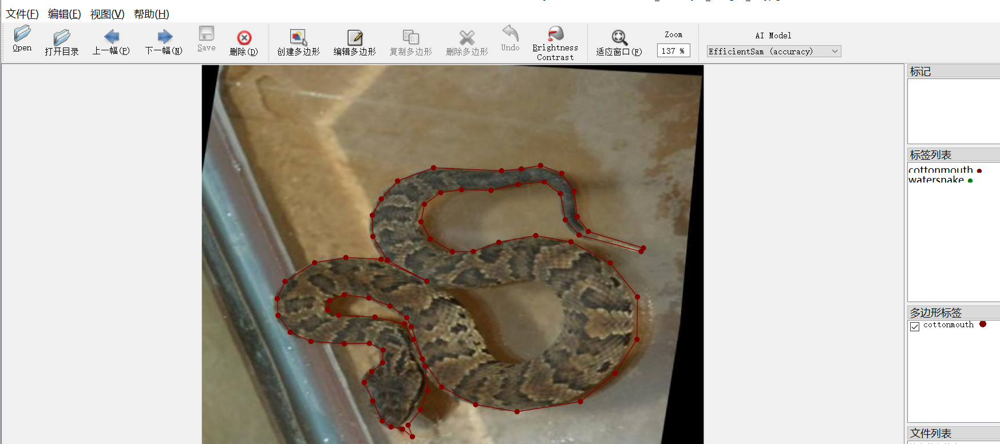

# [Image Segmentation Dataset] Snake Segmentation Dataset - 1386 Images, JSON Format

The dataset is formatted as a JSON file with images in JPEG format.

Number of images (JPEG files): 1386

Number of annotations (JSON files): 1386

Number of annotation categories: 2

Annotation category names: ["cottonmouth", "watersnake"]

Number of bounding boxes for each category:

- Cottonmouth count = 1131
- Watersnake count = 809

Annotation tools used: labelme version 5.5.0

Annotation rules: polygons are drawn around the categories.

Important Note: The dataset can be opened and edited using the labelme tool. The JSON dataset requires conversion into either mask or yolo format for semantic segmentation or instance segmentation.

Special Remark: This dataset does not guarantee the accuracy or precision of the trained models or weight files. The dataset provides accurate and reasonable annotations only.

## Images

---

Here is a pay link on Stripe (https://buy.stripe.com/3cs8yP7sY87d0vu9AB). Please contact me lonlonago@foxmail.com after funding $89, and I will send you a complete data files, thank you!

